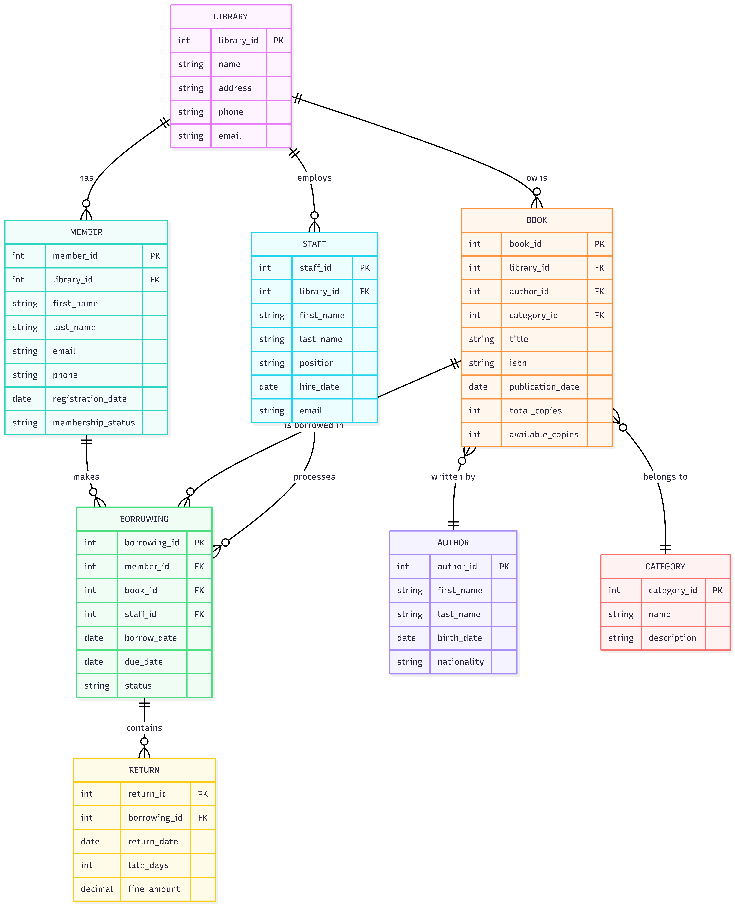
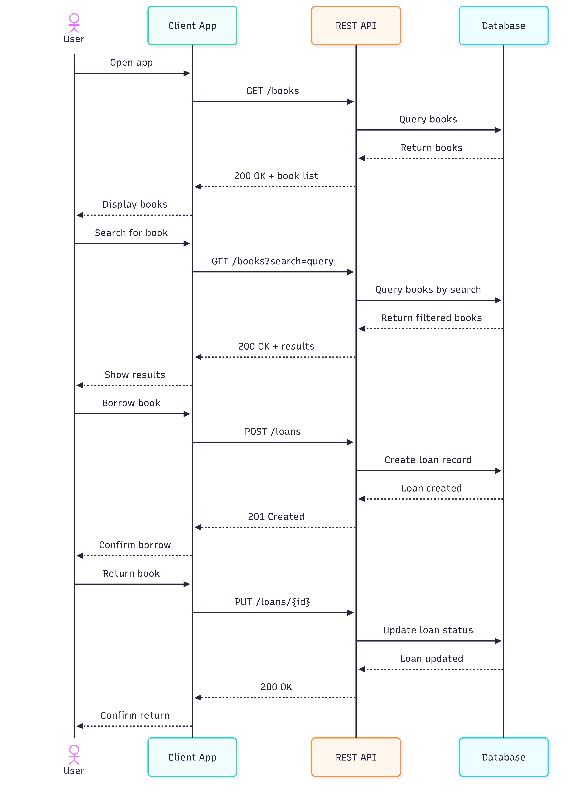

# Diagrammen

## ERD

    erDiagram
    LIBRARY ||--o{ MEMBER : has
    LIBRARY ||--o{ BOOK : owns
    LIBRARY ||--o{ STAFF : employs
    MEMBER ||--o{ BORROWING : makes
    BOOK ||--o{ BORROWING : "is borrowed in"
    BOOK }o--|| AUTHOR : "written by"
    BOOK }o--|| CATEGORY : "belongs to"
    BORROWING ||--o{ RETURN : contains
    STAFF ||--o{ BORROWING : processes

    LIBRARY {
        int library_id PK
        string name
        string address
        string phone
        string email
    }

    MEMBER {
        int member_id PK
        int library_id FK
        string first_name
        string last_name
        string email
        string phone
        date registration_date
        string membership_status
    }

    BOOK {
        int book_id PK
        int library_id FK
        int author_id FK
        int category_id FK
        string title
        string isbn
        date publication_date
        int total_copies
        int available_copies
    }

    AUTHOR {
        int author_id PK
        string first_name
        string last_name
        date birth_date
        string nationality
    }

    CATEGORY {
        int category_id PK
        string name
        string description
    }

    BORROWING {
        int borrowing_id PK
        int member_id FK
        int book_id FK
        int staff_id FK
        date borrow_date
        date due_date
        string status
    }

    RETURN {
        int return_id PK
        int borrowing_id FK
        date return_date
        int late_days
        decimal fine_amount
    }

    STAFF {
        int staff_id PK
        int library_id FK
        string first_name
        string last_name
        string position
        date hire_date
        string email
    }

## Sequence Diagram

    sequenceDiagram
    actor User
    participant Client as Client App
    participant API as REST API
    participant DB as Database
    
    User->>Client: Open app
    Client->>API: GET /books
    API->>DB: Query books
    DB-->>API: Return books
    API-->>Client: 200 OK + book list
    Client-->>User: Display books
    
    User->>Client: Search for book
    Client->>API: GET /books?search=query
    API->>DB: Query books by search
    DB-->>API: Return filtered books
    API-->>Client: 200 OK + results
    Client-->>User: Show results
    
    User->>Client: Borrow book
    Client->>API: POST /loans
    API->>DB: Create loan record
    DB-->>API: Loan created
    API-->>Client: 201 Created
    Client-->>User: Confirm borrow
    
    User->>Client: Return book
    Client->>API: PUT /loans/{id}
    API->>DB: Update loan status
    DB-->>API: Loan updated
    API-->>Client: 200 OK
    Client-->>User: Confirm return

## Use Case Diagram

    graph TB
    subgraph Library["Bibliotheek App"]
        SearchBooks["Boeken Zoeken"]
        ViewDetails["Details Bekijken"]
        BorrowBook["Boek Uitlenen"]
        ReturnBook["Boek Terugbrengen"]
        ViewLoans["Uitleningen Bekijken"]
        RenewBook["Boek Verlengen"]
        ReserveBook["Boek Reserveren"]
        ManageProfile["Profiel Beheren"]
        PayFines["Boetes Betalen"]
        SubmitReview["Recensie Plaatsen"]
    end
    
    Member["Bibliotheeklid"]
    Guest["Gast"]
    Librarian["Bibliothecaris"]
    
    Member -->|gebruikt| SearchBooks
    Member -->|gebruikt| ViewDetails
    Member -->|gebruikt| BorrowBook
    Member -->|gebruikt| ReturnBook
    Member -->|gebruikt| ViewLoans
    Member -->|gebruikt| RenewBook
    Member -->|gebruikt| ReserveBook
    Member -->|gebruikt| ManageProfile
    Member -->|gebruikt| PayFines
    Member -->|gebruikt| SubmitReview
    
    Guest -->|gebruikt| SearchBooks
    Guest -->|gebruikt| ViewDetails
    
    Librarian -->|beheert| BorrowBook
    Librarian -->|beheert| ReturnBook
    Librarian -->|beheert| ViewLoans
    
    style Library fill:#e1f5ff
    style Member fill:#c8e6c9
    style Guest fill:#ffe0b2
    style Librarian fill:#f8bbd0

## Class Diagram

    classDiagram
    class User {
        +String id
        +String name
        +login()
        +logout()
    }
    class Member {
        +String membershipId
        +reserveBook(bookId)
        +returnBook(loanId)
    }
    class Librarian {
        +String employeeId
        +addBook(book)
        +removeBook(bookId)
        +manageLoan(loanId)
    }
    class Book {
        +String isbn
        +String title
        +String author
        +bool isAvailable
    }
    class Loan {
        +String loanId
        +Date loanDate
        +Date dueDate
        +returnBook()
    }
    class Catalog {
        +searchBook(title)
        +listAvailableBooks()
    }
    User <|-- Member
    User <|-- Librarian
    Member "1" o-- "*" Loan : borrows
    Loan "*" o-- "1" Book : covers
    Catalog "1" o-- "*" Book : contains

